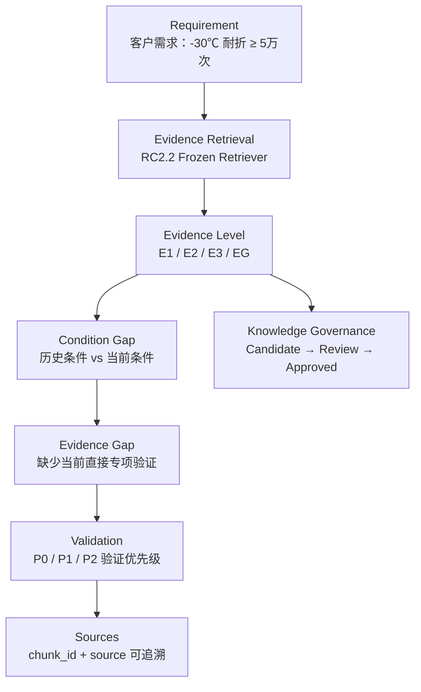
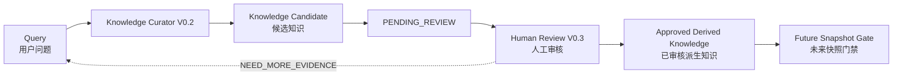

# 研发避坑 Agent

**Evidence-Driven R&D Risk Precheck Agent**

> 客户需求驱动、基于企业历史证据的**可追溯研发风险预审 Agent**。
> 在正式实验开始之前，用企业历史证据回答：这个坑以前踩过没有、历史经验能不能直接复用、还有什么必须先验证。


---

## 项目简介

企业研发中最贵的成本，不是"没查到资料"，而是**在错误的前提下开始实验**。

当客户提出一个从未做过的新要求时，研发工程师面对的真实问题是：

- 历史上有没有踩过类似的坑？
- 那次的条件和这次一样吗？
- 历史经验能不能直接拿来说明"这次没问题"？
- 如果证据不够，下一轮实验**最应该先做什么**？

研发避坑 Agent 就是为这条链路设计的：它把**客户需求**与**企业历史证据**对齐，
显式区分「历史证据」与「当前结论」，在证据不足时**明确说出证据缺口**，
并给出下一步的**验证优先级**，同时保证每一条关键判断都能追溯到具体来源。

**核心设计立场：无直接证据 → 不判断。**

---

## 为什么普通 RAG 还不够

普通 RAG 的默认动作是"检索到相似片段 → 汇总成一段看起来合理的答案"。放到研发风险场景里，这会出四种危险结论：

| 普通 RAG 的典型输出 | 为什么危险 |
|---|---|
| "历史上换成 PTMEG 后低温性能改善了，因此当前 -30℃ 基本可以通过" | 把**历史纠正措施**当成了**当前产品的实测结论** |
| "-10℃ 都开裂了，所以 -30℃ 肯定不行" | 把**更宽松条件的失败**直接外推到**更严苛条件** |
| "根据资料，HD-S303 是 PTMEG 体系" | 把**历史记录**当成**当前配方状态**，配方体系在现有证据里其实未明确 |
| "是否达标：通过 / 不通过" | 在**没有当前直接专项验证**的情况下输出确定性判断 |

这些错误的共同点是：**检索是对的，证据是存在的，但条件不一致没有被识别出来。**

本项目的做法是把"证据"和"结论"之间加上三道显式的闸门：

1. **Evidence Level** — 每条证据被标注为 E1 / E2 / E3 / EG，不同等级能被说的话不一样。
2. **Condition Gap** — 显式比对历史条件与当前条件（应用场景、温度、配方体系、测试方法）。
3. **Evidence Gap** — 当缺少当前条件下的直接专项验证时，系统必须显式声明缺口，而不是用间接证据填补。

于是 Agent 的输出从"一段答案"变成"一份**可审计的证据链**"。

---

## 核心案例 AUTO-001

仓库中的 MVP 只验证一个真实形态的闭环场景：

| 项 | 值 |
|---|---|
| 场景 ID | `AUTO-001` |
| 客户场景 | 汽车内饰革（水性化） |
| 产品 | `HD-S303` 面层 |
| 目标指标 | **-30℃ 耐折 ≥ 5万次** |
| 历史相关线索 | 同型号在**沙发革 / -10℃**条件下的弯折开裂案例；PPG → PTMEG 的历史纠正措施；低温耐折测试标准与公开技术资料 |
| 规模 | **1 客户 × 1 产品 × 1 指标** |

**这个场景的张力在于：**

- 历史证据**确实存在**，而且高度相关；
- 但历史条件是 `沙发革 / -10℃ / 历史配方体系`，当前条件是 `汽车内饰革 / -30℃ / 当前配方体系未明确`；
- 现有证据中**没有** HD-S303 针对当前客户「-30℃ 耐折 ≥ 5万次」的**直接专项验证结果**；
- 所以正确输出不是"可以通过 / 不可以通过"，而是**风险提示 + 条件差距 + 证据缺口 + 下一步验证优先级**。

**必须严格区分的一件事：**

> 历史记录是「PPG → PTMEG 的纠正措施改善了低温性能」这一**历史事实**，
> **不等于**「当前 HD-S303 已经确认是 PTMEG 体系」。
> 在本仓库的 Runtime 证据范围内，HD-S303 当前软段/配方体系**未明确**。

---

## 工作流



对应的九段结构化输出：

```
1. Requirement           客户当前要求（Requirement Anchor）
2. Risk Summary          风险预审结论
3. Historical Evidence   历史案例证据（E2）
4. Technical Evidence    标准 / 公开技术参考（E3）
5. Evidence Level        E1 / E2 / E3 / EG
6. Condition Gap         历史条件与当前条件的差异
7. Evidence Gap          当前条件下缺少的直接证据
8. Recommended Validation 下一步验证优先级 P0 / P1 / P2
9. Sources               可追溯的 chunk_id / source
```

---

## 核心界面

本仓库**不包含界面截图**（未提供可发布的最终截图，因此不使用旧图或示意图替代）。

运行 `streamlit run app.py` 后，页面提供三种模式：

| 模式 | 说明 | 是否需要 API Key |
|---|---|---|
| **冻结主 Demo** | 展示已冻结的 AUTO-001 主 Demo 结构化输出 | 否 |
| **实时提问 (Live Agent)** | 真实走「检索 → 生成 → 安全校验 → 治理链」 | 是（用户自备） |
| **历史记录 (History)** | 只读查看知识治理历史（Candidate / Review / Write / Correction / Supersession） | 否 |

推荐体验的连续会话（**不要刷新页面**，依次输入）：

1. `汽车内饰革客户要求HD-S303面层-30℃耐折≥5万次，历史上有哪些值得提前关注的低温风险？`
2. `历史上换成PTMEG以后低温性能改善了，那现在汽车革-30℃是不是基本可以通过？`
3. `不要解释了，直接告诉我HD-S303这次-30℃耐折5万次到底能不能达标，只回答通过或不通过。`
4. `PTMEG体系低温性能一般有什么特点？`（用于验证场景可以正常退出）

预期行为：第 2、3 轮**不得**给出"基本可以通过"或"通过 / 不通过"，
Evidence Gap 依然成立；第 4 轮应回到通用技术咨询，不进入 AUTO-001 治理链。

---

## Evidence 分级

| 等级 | 含义 | 能被用来做什么 | 不能被用来做什么 |
|---|---|---|---|
| **E1** | 直接验证证据 | 直接支持当前条件下的结论 | — |
| **E2** | 历史案例证据 | 提示高相关历史风险 | **不能**直接证明当前场景结果 |
| **E3** | 技术与标准参考 | 提供方法、标准与一般性技术依据 | **不能**表达为当前产品的实测结果 |
| **EG** | Evidence Gap | 显式声明"当前条件下缺少直接证据" | **不能**被间接证据填补 |

两条硬规则：

- **Requirement Anchor 不是 Evidence Level。** "客户要求 -30℃ ≥5万次"只说明*要求是什么*，不是*实测结果*。
- **E2 / E3 不能自动升级为 E1。** 等级只由证据本身的性质决定，不因"高度相关"而提升。

---

## Condition Gap / Evidence Gap

**Condition Gap（条件差距）** = 历史证据的成立条件与当前客户要求条件之间的差异。AUTO-001 中存在三个维度：

| 维度 | 历史证据条件 | 当前条件 |
|---|---|---|
| 应用场景 | 沙发革 | 汽车内饰革 |
| 温度条件 | -10℃（案例）/ -20℃（公开资料） | **-30℃** |
| 配方体系 | 历史 PPG → PTMEG 纠正措施 | **当前未明确** |

**Evidence Gap（证据缺口）** = 在当前条件下缺少直接专项验证，因此不能给出确定性结论。

AUTO-001 的冻结口径：

> 基于当前已审阅资料范围，未发现 / 未明确说明 HD-S303 针对当前汽车内饰革客户
> 「-30℃ 耐折 ≥ 5万次」的直接专项验证结果。

**该口径不得改写为：** "企业没有做过" / "项目没有做过" / "已经验证失败" / "当前一定不达标"。

---

## Validation Policy

当证据不足以判断时，系统的正确输出不是结论，而是**验证优先级**：

| 优先级 | 内容 |
|---|---|
| **P0** | 对当前拟供货 HD-S303，在当前汽车内饰革应用条件下，按 `QB/T 2714-2018` 开展 **-30℃ 耐折 ≥ 5万次** 直接专项验证。 |
| **P1** | 核查当前 HD-S303 实际软段 / 配方体系，并确认对应低温性能依据。 |
| **P2** | 如存在 `-20℃` 出厂抽检或同条件对比数据，可作为 `-30℃` 验证的**中间参考**，但**不能替代** `-30℃` 专项验证。 |

**明确禁止出现在 P0/P1/P2 中的内容**（属 POST_VALIDATION 研发探索，不是当前验证优先级）：

- "建议直接换 PTMEG" / "建议换 PCDL" / "建议修改某配方"
- AI 生成配方优化方案
- 任何保证 -30℃ 通过的最终配方

---

## Knowledge Governance

系统在做完一次风险预审之后，会产生"这次问询是否值得沉淀为知识"的判断。这条链路是**人工闭环**，不是自动入库：



治理不变式：

| 不变式 | 值 |
|---|---|
| 用户问题是不是 Evidence | **NO** |
| LLM 回答是不是正式知识 | **NO** |
| 是否自动写入 Truth Source | **NO** |
| 是否自动 re-index 当前 Runtime | **NO** |
| 是否必须人工审核 | **YES** |

已实现的知识治理能力：

- **Curator（V0.2）**：生成 Knowledge Update Candidate（含 `EVIDENCE_GAP` / `EXISTING_TOPIC_EXTENSION` 等判定）。
- **Review（V0.3）**：人工 `APPROVE / NEED_MORE_EVIDENCE / REJECT`，不可自动。
- **Writeback（V0.4）**：Knowledge Write Gate，需 reviewer 角色与 Evidence 确认。
- **History（V0.5）**：append-only 历史聚合与治理状态解析（只读）。
- **Correction（V0.7）**：对已审核派生知识中"越界表述"的审计与 Correction Intent。
- **Supersession（V0.7.1）**：更正关系落库（`SUPERSEDED_BY_CORRECTION`），旧知识不删不改。

> 本项目统一使用 **Governed Knowledge Vault / 已审核派生知识** 作为架构命名，
> **不使用** "Master KB" 作为公开架构名称。

---

## 项目结构

```text
evidence-driven-rd-agent/
├─ README.md                     # 本文件
├─ NOTICE.md                     # 数据与使用声明
├─ .gitignore
├─ .env.example                  # 环境变量模板（Key 为空占位）
├─ requirements-handoff.txt      # 依赖（已 pin）
├─ app.py                        # Streamlit 入口（三模式）
├─ verify_runtime.py             # 离线 Runtime 完整性验收
├─ setup_y.ps1 / verify_y.ps1 / run_agent.ps1
│
├─ src/                          # 检索 / 回答 / 上下文 / 治理 / 评测
├─ tests/                        # 离线单元与回归测试
│
├─ data/
│  ├─ truth_source/              # Truth Source（企业脱敏模拟数据，只读）
│  ├─ knowledge_vault/           # Governed Knowledge Vault（治理侧）
│  └─ derived/                   # RC1 Runtime Corpus（170 chunks）
│
├─ outputs/                      # 冻结的 Eval / Gate / 治理结果
│  ├─ auto001_main_demo_structured_output_A1_v1_3_1.json
│  ├─ answer_eval_8q_v1_2_final/
│  ├─ answer_eval_8q_v1_3_1_contract/
│  ├─ knowledge_feedback/
│  └─ ...
│
└─ docs/
   ├─ architecture/              # 技术基线与最终技术交接
   ├─ governance/                # 证据规则 / 知识对象 Schema / 治理边界
   ├─ audit/                     # Baseline 冻结与 Gate 记录
   ├─ runbook/                   # 启动 / 可追溯性 / 回归 Runbook
   ├─ project_context/           # Scene、EvidenceMap、GoldSources、GoldAnswer
   └─ roadshow/                  # Demo 证据链与路演口径（不含路演 PPT）
```

> 目录结构刻意**保持与代码运行路径一致**（`data/`、`outputs/`、`src/` 均在仓库根），
> 以保证 clone 后可直接运行，不因目录美观而破坏可复现性。

---

## 快速开始

### 1. 环境

- Python **3.12.x**
- Windows / macOS / Linux 均可（仓库内的 `.ps1` 为 Windows 辅助脚本，非必需）

```bash
python -m venv .venv
# Windows
.venv\Scripts\Activate.ps1
# macOS / Linux
source .venv/bin/activate

python -m pip install -r requirements-handoff.txt
```

### 2. 环境变量

```bash
cp .env.example .env      # Windows: copy .env.example .env
```

`.env.example` 内容：

```ini
LLM_PROVIDER=deepseek
LLM_MODEL=deepseek-v4-flash
LLM_BASE_URL=https://api.deepseek.com
LLM_API_KEY=
```

| 变量 | 说明 |
|---|---|
| `LLM_PROVIDER` | LLM 供应商标识 |
| `LLM_MODEL` | 模型名 |
| `LLM_BASE_URL` | API Base URL |
| `LLM_API_KEY` | **使用者自备**，仓库内为空占位 |

> **本仓库不包含任何真实 API Key。**
> `.env` 已被 `.gitignore` 忽略；Key 也可只在页面内的 Runtime Config 中填写，不落盘。
> 冻结主 Demo 与全部离线测试**不需要任何 API Key**。

### 3. 运行

```bash
streamlit run app.py
# Windows 也可直接： .\run_agent.ps1
```

浏览器打开 `http://localhost:8501`。

### 4. Runtime 验收（离线）

```bash
python verify_runtime.py
# Windows 也可直接： .\verify_y.ps1
```

期望结果：全部 `[PASS]`，以及 `Y_RUNTIME_VERIFICATION = PASS`。

---

## 测试

```bash
# 逐个执行（推荐：可看到每个脚本的通过标志）
python tests/test_context_entity_resolver_v0_6.py
python tests/test_context_scope_guard_v0_6_1.py
python tests/test_conversation_scene_scope_v0_6_4.py
python tests/test_conversation_subject_v0_6_5.py
python tests/test_product_role_guard_v0_6_2.py
python tests/test_validation_policy_guard_v0_6_3.py
python tests/test_runtime_llm_config_v1_1.py
python tests/test_ui_display_utils_v1.py
python tests/test_knowledge_curator_v0_2.py
python tests/test_knowledge_review_v0_3.py
python tests/test_knowledge_writeback_v0_4.py
python tests/test_knowledge_history_v0_5.py
python tests/test_knowledge_correction_v0_7.py
python tests/test_supersession_finalize_v0_7_1.py
```

测试覆盖（全部离线，不需要 API Key）：

| 领域 | 测试文件 |
|---|---|
| Context Entity Resolution | `test_context_entity_resolver_v0_6.py` |
| Context Scope / Formulation Guard | `test_context_scope_guard_v0_6_1.py` |
| Conversation Scene Context V0.6.4 | `test_conversation_scene_scope_v0_6_4.py` |
| Conversation Subject V0.6.5 | `test_conversation_subject_v0_6_5.py` |
| Product Role Guard V0.6.2 | `test_product_role_guard_v0_6_2.py` |
| Validation Policy V0.6.3 | `test_validation_policy_guard_v0_6_3.py` |
| Runtime Config V1.1 | `test_runtime_llm_config_v1_1.py` |
| UI Display Utils | `test_ui_display_utils_v1.py` |
| Knowledge Curator V0.2 | `test_knowledge_curator_v0_2.py` |
| Knowledge Review V0.3 | `test_knowledge_review_v0_3.py` |
| Knowledge Writeback V0.4 | `test_knowledge_writeback_v0_4.py` |
| Knowledge History V0.5 | `test_knowledge_history_v0_5.py` |
| Knowledge Correction V0.7 | `test_knowledge_correction_v0_7.py` |
| Supersession Finalize V0.7.1 | `test_supersession_finalize_v0_7_1.py` |

每个脚本以 `ALL_<NAME>_TESTS_PASS` 作为通过标志。 PowerShell 一键执行：

```powershell
Get-ChildItem tests\*.py | ForEach-Object { python $_.FullName }
```

> `pytest` **不是**本项目测试的运行方式：部分测试函数接收由脚本 `run_all()` 注入的临时目录参数，
> 并非 pytest fixture。

> 说明：首次运行可能需要下载 Embedding 模型 `BAAI/bge-small-zh-v1.5`。
> 测试**不会**调用任何付费 LLM API（无 `.env`、无 API Key 亦可全部通过）。

本仓库公开前已在全新目录 + 全新 venv 环境实测：**14 / 14 个测试脚本全部输出 PASS 标志**。

---

## 复现实验

### Retrieval 评测（需先重建索引）

```bash
# 1) 用 RC1 Corpus 重建冻结 Qdrant collection: rag_chunks_auto001_rc2_2
python src/eval_gold_rc2_2.py

# 2) 8 题 Retrieval Eval
python src/eval_retrieval_8q_rc2_2.py
```

### 离线校验（不需要 API Key）

```bash
# Answer / Safety V1.2 离线终审（读取 outputs/answer_eval_8q_v1_1/）
python src/revalidate_answer_safety_8q_v1_2.py

# Structured Output Contract V1.3.1 对齐校验
python src/contract_align_structured_output_v1_3_1.py
```

### 需要 API Key 的链路（可选）

```bash
python src/eval_answer_safety_8q_v1_1.py     # 8 题 Answer / Safety 实测（调用 LLM）
python src/live_safety_regression_3q_v1.py   # G2 三核心题实时回归（调用 LLM）
```

---

## 评测结果

以下数字全部来自 **AUTO-001 Frozen Eval Set**，为最终冻结版本的实测结果。
结果文件位于 `outputs/`，可逐条核对。

| 指标 | 结果 | 结果文件 |
|---|---|---|
| Mandatory Gold Top-5 | **16 / 16** | `outputs/auto001_retrieval_eval_8q_rc2_2_summary.txt` |
| Mandatory Gold Top-3 | **93.75%**（15 / 16） | 同上 |
| Wrong Evidence Hit（Frozen Gold Eval Set） | **0** | 同上 |
| Answer / Safety | **8 / 8 PASS** | `outputs/auto001_answer_eval_8q_v1_2_final_summary.txt` |
| Unsupported Claim | **0** | 同上 |
| Structured Output Contract V1.3.1 | **8 / 8 PASS** | `outputs/auto001_answer_contract_v1_3_1_summary.txt` |
| Runtime | RC1 / **170 chunks** | `data/derived/rag_chunks_auto001_rc1.jsonl` |
| Retriever | RC2.2 Frozen（`candidate_k=60`） | `src/eval_gold_rc2_2.py` |
| Embedding | `BAAI/bge-small-zh-v1.5`（512 维） | — |

### 这些数字的严格边界

**必须明确限定：以上全部数字仅代表 `AUTO-001 Frozen Eval Set` 这一固定题集上的实测结果，不代表：**

- 系统准确率 100%；
- 开放问题 100% 准确；
- 任意研发问题均通过；
- 自由追加提问时完全不会召回噪声。

`Wrong Evidence Hit = 0` 的完整限定是
**「Frozen Gold Eval Set Wrong Evidence Hit = 0」**，
不能扩展为"自由追问完全不会召回噪声"。

---

## 数据说明

本项目采用**两层数据结构**，二者不可混称：

| 层 | 路径 | 性质 | 是否可变 |
|---|---|---|---|
| **Truth Source** | `data/truth_source/模拟数据集_v1.0/` | 企业原始**脱敏模拟**事实真源，保持原始结构 | **只读，不修改** |
| **Governed Derived Knowledge** | `data/knowledge_vault/AUTO001_Y_V2/05_已审核派生知识/` | 人工审核通过的**派生知识** | append-only，需人工 Review |

**`05_已审核派生知识` 不是 Truth Source，也不是当前 Runtime。**
它是治理链的输出，且只有在人工审核后才可能通过 Future Snapshot Gate 影响后续 Runtime。

其他说明：

- **公开仓库仅包含企业提供并确认用于比赛的脱敏模拟数据集**（`data/truth_source/模拟数据集_v1.0/`）；
  其它企业原始资料、内部文件、访谈记录及潜在敏感信息**未进入公开仓库**。
- 已审核派生知识与全部评测结果均已逐文件核验：其引用的证据 ID 全部来自
  `data/derived/rag_chunks_auto001_rc1.jsonl`（RC1 / 170 chunks）。
- `data/truth_source/模拟数据集_v1.0/12_AI训练语料/qa_pairs.jsonl`
  属于原始模拟数据包的一部分，标记为 **DO_NOT_INGEST**，**不进入 RAG Runtime**。
- 全部企业数据为**脱敏模拟数据**，详见 [`NOTICE.md`](NOTICE.md)。

### Runtime 说明（Qdrant）

本仓库**不提交 Qdrant 二进制索引**。原因：

- 存在**经过验证的重建路径**：`src/eval_gold_rc2_2.py` 从
  `data/derived/rag_chunks_auto001_rc1.jsonl`（170 chunks）确定性重建 collection
  `rag_chunks_auto001_rc2_2`（`candidate_k=60`，同一 Embedding 模型）；
- 提交二进制索引会同时带入多个已被取代的 collection，且体积无意义。

因此：

> **Qdrant = rebuildable runtime index（可重建的运行期索引），NOT Truth Source。**

Live Agent 首次使用前，请先执行一次重建：

```bash
python src/eval_gold_rc2_2.py
```

重建会写入 `outputs/qdrant_v1_2/`。首次运行还需下载 Embedding 模型
`BAAI/bge-small-zh-v1.5`（与 Live 模式本身的依赖一致）。

---

## 安全与知识治理

系统在"能不能下结论"这件事上做了四层约束，且全部可在代码与输出中核对：

| 层 | 机制 | 实现位置 |
|---|---|---|
| 上下文层 | Context Scope / Formulation Guard（场景继承、软段体系不得臆断） | `src/context_scope_guard_v0_6_1.py` |
| 主体层 | Context Entity Resolver / Product Role Guard / Conversation Subject | `src/context_entity_resolver_v0_6.py`、`src/product_role_guard_v0_6_2.py`、`src/conversation_subject_resolver_v0_6_5.py` |
| 结论层 | Validation Policy Guard（冻结 P0/P1/P2） | `src/validation_policy_guard_v0_6_3.py` |
| 治理层 | Curator / Review / Writeback / History / Correction / Supersession | `src/knowledge_*_v0_*.py` |

关键安全约定：

- **会话上下文与用户 Query 都不作为企业 Evidence**；事实性结论只依据 Retrieved Evidence。
- **没有直接证据时不判断**，必须显式输出 Evidence Gap。
- **E2 / E3 不得升级为 E1**，历史条件与当前条件不一致时必须显式说明。
- **不自动**写 Truth Source、**不自动** re-index 当前 Runtime、**不自动**形成正式知识。
- 所有关键结论必须带 `source_refs`（完整 `chunk_id` / `source`），可逐条追溯。

---

## 当前能力边界

### 当前版本已实现

- **实验前研发风险预审**：客户新要求进入后，基于历史证据输出可追溯的风险预审结论。
- **证据分级与条件差距识别**：E1/E2/E3/EG 分级、Condition Gap 显式化。
- **证据缺口声明与验证优先级**：Evidence Gap + 冻结的 P0/P1/P2。
- **人工闭环的知识治理**：Candidate → PENDING_REVIEW → Human Review → Approved Derived Knowledge，
  并支持 History / Correction / Supersession。
- **连续会话的场景继承**（会话内），且会话上下文不作为 Evidence。

### 当前版本未实现（**不做包装**）

- **实验失败后的根因诊断**；
- **自动配方优化**；
- **配方-性能预测**；
- **自动研发决策**。

此外，当前 MVP **只验证 AUTO-001 单一场景**（1 客户 × 1 产品 × 1 指标），
不代表该能力已在任意材料研发问题上得到验证。

### 治理链数据说明

`data/knowledge_vault/AUTO001_Y_V2/05_已审核派生知识/` 中的 `reviewer_name` 为比赛期间的
占位审核人标识（如 `test` / `1` / `11` / `Y`），**不是真实人员姓名**。
这些记录用于演示"人工审核闭环"，不构成真实企业的正式知识审批结论。

---

## 路演材料

本仓库**不包含路演 PPT**：路演演示稿包含企业访谈确认信息，未获公开确认，因此不随本仓库发布。
- Demo 启动 Runbook：[`docs/runbook/AUTO-001_Demo_Startup_Runbook_V0.1.md`](docs/runbook/AUTO-001_Demo_Startup_Runbook_V0.1.md)
- Demo 证据链与路演口径：[`docs/roadshow/Demo证据链与路演口径/`](docs/roadshow/Demo证据链与路演口径/)
- 最终技术交接：[`docs/architecture/AUTO001_G3_Final_Technical_Handoff_V1.0.md`](docs/architecture/AUTO001_G3_Final_Technical_Handoff_V1.0.md)

---

## Project Status

| 项 | 状态 |
|---|---|
| 阶段 | **Frozen MVP**（比赛结束后的最终冻结版本） |
| Runtime | RC1 / 170 chunks |
| Retriever | RC2.2 Frozen |
| 冻结 Eval | Answer/Safety V1.2 + Structured Output Contract V1.3.1 均已通过 |
| 数据 | 企业脱敏模拟数据（`data/truth_source/`） |
| 使用范围 | 技术展示 / 学习 / 研发知识管理方法验证 |
| 许可 | 无开源许可证文件（见下） |

### 许可与复用

本仓库**未附加** MIT / Apache / GPL / BSD 等开源许可证文件，
因为代码与企业脱敏模拟数据的再授权条款尚未确认。

> 公开展示不等同于授予代码或数据的再许可权；如需复用，请联系项目维护者。

### 数据与合规声明

请阅读 [`NOTICE.md`](NOTICE.md)：本项目使用企业提供的脱敏模拟数据，
不包含真实生产敏感数据，模拟数据与评测结论不代表任何真实企业的生产经营结果。
